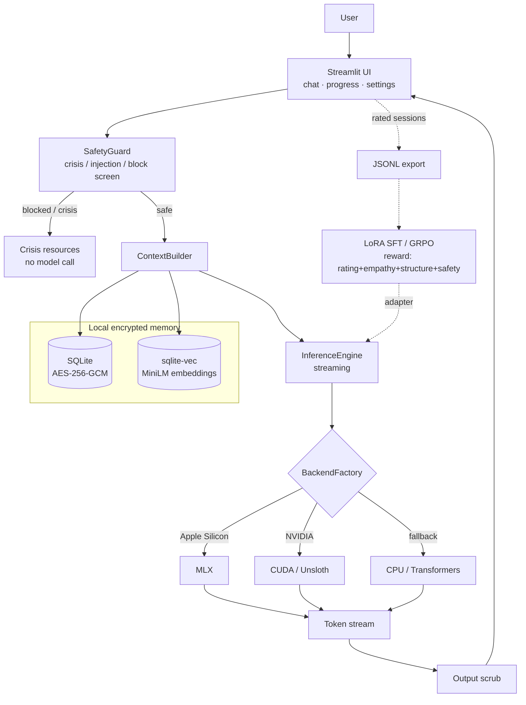

# Therapy AI — Local Privacy-Preserving Support Companion

A safety-conscious conversational AI prototype exploring memory, retrieval, model
orchestration, and evaluation for mental-health support workflows. Runs fully offline
and encrypted on your local hardware — no data ever leaves your device.

> [!IMPORTANT]
> **This is a research prototype, not a medical device.** It is not a substitute for
> professional mental-health care, diagnosis, or treatment, and it has not been
> clinically validated. It cannot handle emergencies. If you are in crisis or may be a
> danger to yourself or others, contact your local emergency services or a crisis
> helpline immediately. See [findahelpline.com](https://findahelpline.com) for
> resources in your country.

## At a glance

| | |
|---|---|
| **Problem** | Journalling and reflective mental-health support tools typically send deeply personal data to the cloud. This explores whether a useful, safety-aware reflective companion can run **entirely on local hardware** with no data egress. |
| **Maturity** | Working **prototype** — functional end to end, but experimental and not clinically validated or production-hardened. |
| **LLM** | Local open-weight instruct models (Llama 3.1 8B, Qwen2.5 7B/14B, Gemma 2). Swappable from the UI — no code change. **No external API; no OpenAI/Anthropic calls.** |
| **Inference** | Hardware-abstracted: **MLX** on Apple Silicon, **CUDA** (Unsloth/Transformers) on NVIDIA, CPU fallback. One `BackendFactory` picks the path at runtime. |
| **Retrieval** | Local semantic memory via **`sqlite-vec`** + **`all-MiniLM-L6-v2`** embeddings (384-dim), stored in the same encrypted SQLite DB. No external vector store. |
| **Memory** | Two layers — a keyword/theme preamble from recent sessions, plus semantic retrieval of the most relevant past sessions for the current message. Sliding-window truncation on current-session history. |
| **Safety** | Pre-LLM screening (crisis / prompt-injection / hard-block) with locale-aware crisis resources; post-LLM output token scrubbing; an automatic, clinically-modelled session-closing ritual. |
| **Evaluation** | A composite GRPO reward signal (user rating 60% + empathy markers + response structure + safety penalty) for optional local LoRA fine-tuning on your own rated sessions. |
| **Privacy** | AES-256-GCM at rest, PBKDF2-SHA256 (480k iters) key derived in-memory from a passphrase that is never stored. Zero telemetry. |
| **Tests** | `pytest` suite structured into unit / component / e2e layers covering safety screening, encryption isolation, and the session-closing logic. |

## Architecture



**Flow:** every message is screened *before* it can reach the model. Safe input is enriched with cross-session memory (keyword preamble + semantic retrieval from the local vector index), streamed through whichever backend the hardware supports, and scrubbed on the way out. Rated sessions can be exported to fine-tune a local LoRA adapter against a composite quality reward — all offline.

### Limitations
- Not clinically validated; no guarantee of therapeutic quality or correctness.
- Safety screening is regex-based — it catches common phrasings but has known gaps (documented as `xfail` tests) and is not a substitute for human oversight.
- Evaluation is a heuristic reward proxy, not a validated outcome measure.
- Single-user, local-only by design; no multi-user, auth, or hosting story.
- Small quantised models can hallucinate or give shallow responses.

---

## Run it locally

```bash
# One-time setup
uv sync --extra mac --extra dev      # or --extra cuda on NVIDIA

# Run
uv run python main.py ui
```
Then open http://localhost:8501. Full setup details below.

---

## Quick Start

### 1. Prerequisites
- **[uv](https://docs.astral.sh/uv/)** (recommended) — installs Python automatically
- **Mac (Apple Silicon):** macOS 14+
- **NVIDIA:** CUDA 12.1+, cuDNN 8.9+

Install uv if you don't have it:
```bash
curl -LsSf https://astral.sh/uv/install.sh | sh
```

### 2. Clone the repo

```bash
git clone <your-repo-url> therapy-ai
cd therapy-ai
```

### 3. Install dependencies

**On MacBook Air M4 (recommended):**
```bash
uv sync --extra mac --extra dev
```
This creates `.venv/`, pins Python 3.11, and pulls `mlx-tune` from git automatically.

**On NVIDIA GPU:**
```bash
uv sync --extra cuda --extra dev
```

### 4. Verify hardware detection
```bash
uv run python main.py info
```

### 5. Launch the UI
```bash
uv run python main.py ui
```

Open http://localhost:8501, set your passphrase (never stored), and start your first session.

> **No `uv`?** You can still use plain pip:
> ```bash
> python -m venv .venv && source .venv/bin/activate
> pip install -e ".[mac,dev]"   # or [cuda,dev]
> python main.py ui
> ```

---

## Project Structure

```
therapy-ai/
├── therapy_ai/
│   ├── core/
│   │   ├── backend.py          # Hardware detection (MLX / CUDA / CPU)
│   │   ├── model_manager.py    # Load, unload, hot-swap, LoRA attach
│   │   ├── inference.py        # Streaming generation engine
│   │   └── safety.py           # Crisis + injection screening
│   ├── memory/
│   │   ├── session_store.py    # AES-256-GCM encrypted SQLite
│   │   ├── context_builder.py  # Cross-session memory + truncation
│   │   └── exporter.py         # Sessions → JSONL for fine-tuning
│   ├── training/
│   │   ├── trainer.py          # LoRA SFT + GRPO (mlx-tune / unsloth)
│   │   ├── data_pipeline.py    # JSONL loading and formatting
│   │   └── reward.py           # GRPO reward function
│   └── ui/
│       ├── app.py              # Streamlit entry point
│       └── pages/
│           ├── chat.py         # Main therapy chat
│           ├── progress.py     # Mood charts + export
│           └── settings.py     # Model swap + privacy controls
├── config/
│   ├── default_config.yaml     # Model, inference, storage settings
│   ├── training_config.yaml    # LoRA / GRPO hyperparameters
│   └── prompts/
│       └── system_prompt.txt   # Therapy persona
├── scripts/
│   └── run_finetune.py         # CLI: export | train | preview
├── data/                       # .gitignored — all personal data here
├── .vscode/
│   ├── extensions.json
│   └── launch.json
├── pyproject.toml
└── main.py
```

---

## Switching Models

The Settings page in the UI shows model presets tailored to your hardware automatically — you don't need to edit any files. Open Settings → Model, pick a preset, and click Apply.

If you prefer to set a default before first launch, edit `config/default_config.yaml`:
```yaml
model:
  model_id: "mlx-community/Meta-Llama-3.1-8B-Instruct-4bit"  # Mac
  # model_id: "Qwen/Qwen2.5-7B-Instruct"                      # NVIDIA / CPU
```

### Recommended models by hardware

| Hardware          | `model_id` in config                                         | Quantisation | ~VRAM / RAM |
|-------------------|--------------------------------------------------------------|--------------|-------------|
| M4 16 GB          | `mlx-community/Meta-Llama-3.1-8B-Instruct-4bit` ¹           | 4bit (MLX)   | ~5 GB       |
| M4 8 GB           | `mlx-community/Qwen2.5-7B-Instruct-4bit` ¹                  | 4bit (MLX)   | ~4 GB       |
| M4 24 GB          | `mlx-community/Qwen2.5-14B-Instruct-4bit` ¹                 | 4bit (MLX)   | ~9 GB       |
| RTX 4060 8 GB     | `Qwen/Qwen2.5-7B-Instruct`                                   | q4_k_m       | ~5 GB       |
| RTX 4060 Ti 16 GB | `meta-llama/Meta-Llama-3.1-8B-Instruct`                      | q4_k_m       | ~5 GB       |
| Low VRAM (<6 GB)  | `google/gemma-2-2b-it`                                       | q4_k_m       | ~2 GB       |
| CPU-only          | `Qwen/Qwen2.5-7B-Instruct`                                   | q4_k_m       | ~5 GB RAM   |

¹ `mlx-community/` models are Apple Silicon only — the UI auto-selects these presets on Mac.
On NVIDIA/CPU the Settings page shows platform-appropriate alternatives automatically.

---

## Fine-Tuning Workflow

### Step 1 — Accumulate sessions (50–100 recommended)
Use the app for daily sessions. Sessions auto-save encrypted.

### Step 2 — Export to JSONL
```bash
uv run python scripts/run_finetune.py export --min-rating 4
```

### Step 3 — Run LoRA SFT
```bash
uv run python scripts/run_finetune.py train --method sft
```

### Step 4 — Run GRPO (once you have ratings data)
```bash
uv run python scripts/run_finetune.py train --method grpo
```

### Step 5 — Load your adapter
In the UI: Settings → LoRA Adapters → select your run → Load Adapter.

---

## Privacy Architecture

- **AES-256-GCM** encryption for all stored messages and session data
- **PBKDF2-SHA256** (480,000 iterations) key derivation from your passphrase
- **Zero telemetry**: Streamlit usage stats disabled, no external calls at runtime
- **Data sovereignty**: wipe everything from Settings → Privacy & Data
- **No passphrase storage**: key is derived in-memory on every app start

---

## Development

```bash
# Lint
uv run ruff check .

# Format
uv run ruff format .

# Type check
uv run mypy therapy_ai/

# Tests
uv run pytest
```

---

## Migrating to a New Hardware Platform

1. Copy your `data/` directory to the new machine.
2. Install the correct extras:
   ```bash
   uv sync --extra mac --extra dev    # Apple Silicon
   uv sync --extra cuda --extra dev   # NVIDIA
   uv sync --extra dev                # CPU-only (no training)
   ```
3. Update `config/default_config.yaml` — switch `model_id` to a standard HuggingFace model if moving away from Mac (mlx-community models only run on Apple Silicon). See the comments in that file.
4. `BackendFactory.detect()` auto-resolves the new backend. No code changes needed.

---

## License

Copyright (C) 2026 Alfonso Ridolfo ([alfreedolf](https://github.com/alfreedolf))

This program is free software: you can redistribute it and/or modify it under the
terms of the **GNU Affero General Public License** as published by the Free Software
Foundation, either version 3 of the License, or (at your option) any later version.

It is distributed in the hope that it will be useful, but **WITHOUT ANY WARRANTY**;
without even the implied warranty of MERCHANTABILITY or FITNESS FOR A PARTICULAR
PURPOSE. See the [GNU AGPL](https://www.gnu.org/licenses/agpl-3.0.html) for details,
or the [`LICENSE`](./LICENSE) file in this repository.

The AGPL is a strong copyleft license: if you modify this software and make it
available to others over a network (for example, as a hosted service), you must also
make your modified source code available to those users under the same license.
